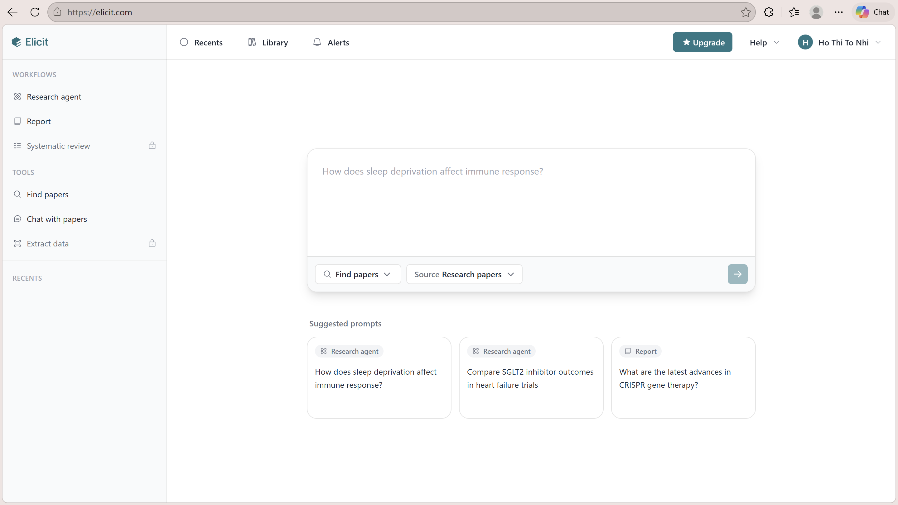
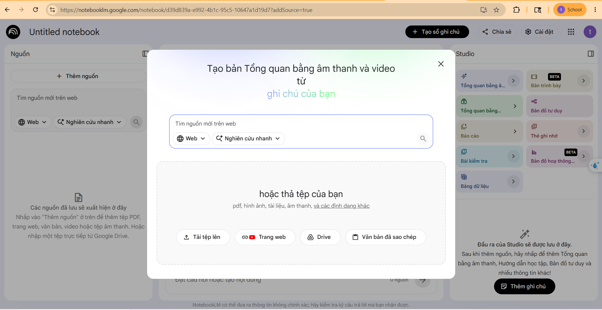
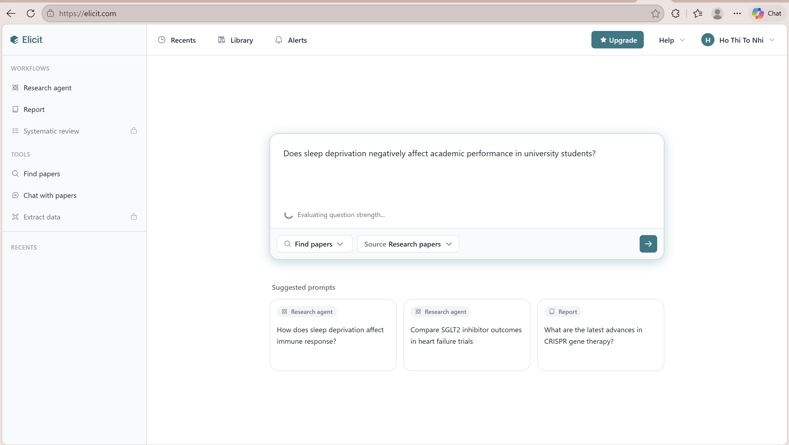
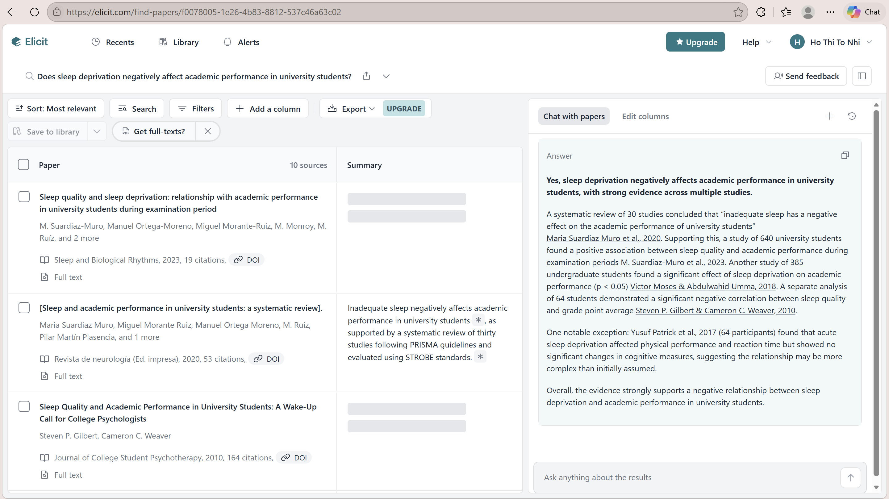
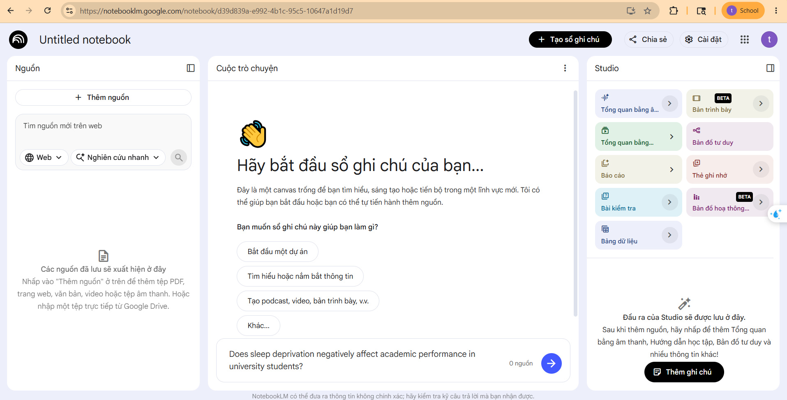
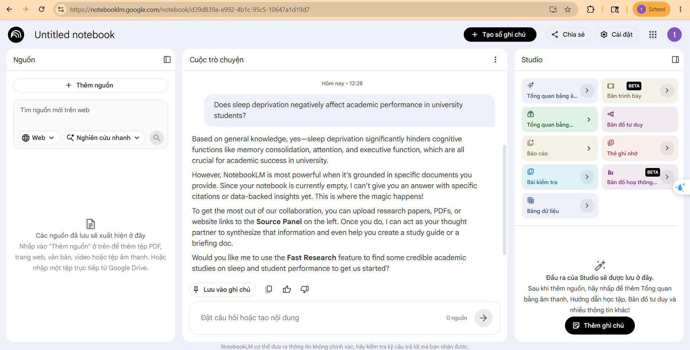

# Analysis Report: AI Product Comparison
**Ngành:** D — Nghiên cứu
**Thành viên:** 2A202600369 (Hồ Thị Tố Nhi) + 2A202600432 (Trần Thị Kim Ngân)
**Nhiệm vụ chung:** Tìm kiếm bằng chứng khoa học đánh giá tác động của việc thiếu ngủ đến kết quả học tập của sinh viên đại học.
**Sản phẩm A:** Elicit (https://elicit.com)
**Sản phẩm B:** NotebookLM (https://notebooklm.google.com)
**Prompt:** "Does sleep deprivation negatively affect academic performance in university students?"

---

# S1 — Product Moment: Entry Point

| Yếu tố | Sản phẩm A (Elicit) | Sản phẩm B (NotebookLM) |
|---|---|---|
| **Entry point** | Giao diện tìm kiếm, kèm gợi ý luồng làm việc. | Sổ tay trống yêu cầu tải nguồn lên. |
| **Ý định user** | Tìm hiểu tổng quan rộng. | Đọc sâu tài liệu cá nhân. |
| **Surface chính** | Search / Table | Chat / Notebook |
| **Paywall** | Cần đăng nhập. Dùng credit. | Đăng nhập Google. Miễn phí 100%. |

**Nhận định:** Elicit tạo ấn tượng tốt (zero-setup) nhờ kho 200M bài báo. NotebookLM tạo rào cản ban đầu vì cần tải PDF lên, phù hợp đọc sâu cá nhân.

---

# S1 — Product Moment: Bằng chứng

**Sản phẩm A:** Giao diện tìm kiếm trực quan có sẵn "Suggested prompts" nhưng yêu cầu đăng nhập trước.

---

# S1 — Product Moment: Bằng chứng

**Sản phẩm B:** Giao diện sổ tay trống, yêu cầu người dùng phải chủ động tải lên các nguồn tài liệu (PDF).

---

# S2 — Workflow Evidence: Luồng người dùng

**TRƯỚC AI:** Sinh viên cần tìm và tổng hợp số liệu về mất ngủ & học tập.

**Sản phẩm A (Elicit):**
1. Gõ prompt vào thanh tìm kiếm.
2. AI quét 200M bài báo, trả về danh sách + tóm tắt.
3. User thêm cột trích xuất dữ liệu (AI trừ credit).

**Sản phẩm B (NotebookLM):**
1. Tự tìm/tải 3-5 bài báo PDF về máy.
2. Upload PDF vào NotebookLM.
3. Gõ prompt, AI trả lời dạng text kèm trích dẫn [1].

**SAU AI:** Đọc, copy vào báo cáo, xuất CSV (Elicit) hoặc nghe Audio (NotebookLM).

---

# S2 — Workflow Evidence: Friction Areas (Lens 3)

| Friction | Sản phẩm A (Elicit) | Sản phẩm B (NotebookLM) |
|---|---|---|
| **Physical load** | Rất nhẹ nhàng (gõ tìm ngay). | Nặng lúc đầu (phải tự tìm/tải PDF). |
| **Cognitive burden** | Cần tư duy học thuật để đọc bảng. | Giảm tải tốt, gợi ý câu hỏi liên quan. |
| **User workarounds** | Hạn chế thử thêm cột sợ tốn tiền. | Phải dùng tool khác (Google Scholar) tìm PDF. |

**Nhận định:** Elicit giảm physical load ban đầu cực tốt. NotebookLM giảm cognitive burden xuất sắc trong quá trình đọc hiểu (nhờ hành văn mạch lạc & gợi ý) bù đắp lại setup rườm rà.

---

# S2 — Workflow Evidence: Bằng chứng Elicit

**Elicit:** Nhập câu hỏi và nhận bảng phân tích dữ liệu tự động.

---

# S2 — Workflow Evidence: Bằng chứng NotebookLM

**NotebookLM:** Hỏi đáp trực tiếp dựa trên nguồn PDF đã cung cấp.

---

# S3 — Output & Trust: Chất lượng & 6 Tín hiệu

**Chất lượng:**
- **Elicit:** Đúng câu hỏi, ít hallucination, đầy đủ (dạng bảng) nhưng yêu cầu tự xâu chuỗi.
- **NotebookLM:** Đúng 100% dựa trên nguồn, không hallucination ngoài luồng, văn mạch lạc.

| Tín hiệu đáng tin | Elicit | NotebookLM |
|---|---|---|
| **Dẫn nguồn** | Có (DOI, link học thuật) | Có (Highlight đúng dòng PDF) |
| **Consistency** | Summary có thể khác đôi chút | Rất nhất quán |
| **User Control** | Có (Thêm/xóa cột, filter) | Có (Chọn nguồn PDF cụ thể) |

**Nhận định:** NotebookLM tạo Trust tuyệt đối nhờ source-grounding. Elicit đáng tin về tính tổng quan, nhưng người dùng phải tự đối chiếu chéo.

---

# S4 — Business Signal: Định vị & Pricing

**Định vị tam giác:**
- **Elicit:** Mạnh-Đắt (LLM tinh chỉnh riêng, mạnh về trích xuất bảng, nhưng credit tốn nhanh).
- **NotebookLM:** Rẻ-Nhanh (Gemini 1.5 Pro, miễn phí, tổng hợp nhanh).

**Pricing Strategy:**
- **Elicit:** Freemium (Credit giới hạn) -> Plus ($10/tháng). Paywall khi thêm cột/hỏi sâu. Ép user chuyên nghiệp nâng cấp.
- **NotebookLM:** Free. Không paywall. Giữ chân user trong hệ sinh thái Google.

---

# S5 — Product Judgment: Verdict & User/Revenue

**Verdict:**
- **Sản phẩm A (Elicit): PROMISING** — Giải quyết trúng pain-point bằng Data Extraction Table, nhưng rào cản credit thu hẹp tập người dùng lười trả phí.
- **Sản phẩm B (NotebookLM): STRONG** — Đột phá với Audio Overview và grounding tuyệt đối, đánh tan hallucination cho việc đọc sâu.

**User & Doanh thu:**
- Không có số liệu công khai cho cả hai.
- Elicit: Ước tính hàng trăm nghìn sinh viên/nhà nghiên cứu. Chiến lược Freemium -> Plus.
- NotebookLM: Tích hợp trong tệp người dùng Google khổng lồ. Miễn phí để làm mồi nhử.

---

# S5 — Product Judgment: Moat & Feature Map

**Moat (Hào cản):**
- **Elicit:** Brand mạnh trong giới học thuật. Switching cost trung bình.
- **NotebookLM:** Distribution khổng lồ (Google), Brand cực mạnh, Switching cost cao (sổ tay cá nhân đã lưu).

**Niche & AI Feature Map:**
- **Elicit:** Niche hẹp (Nhà nghiên cứu). User Value Cao, Business Value Cao, User Alignment Trung bình (paywall).
- **NotebookLM:** Niche rộng (Sinh viên, tác giả). User Value Cao (Audio Overview), User Alignment Cao (Free/Dễ dùng), Business Value Trung bình.

---

# S5 — Product Judgment: Spark/Loop/System & Lab 1

**Giai đoạn:**
- **Elicit:** LOOP — Đã có thói quen dùng ở nhóm cốt lõi, có luồng doanh thu.
- **NotebookLM:** SPARK — Đang viral nhờ Audio Overview, chuẩn bị sang Loop khi tích hợp Google Drive.

**Bài học Lab 1 Disruption:**
- Cần gắn ứng dụng AI vào workflow hiện có (NotebookLM) hoặc tạo ra pain-killer đặc thù (Elicit).
- Không có Distribution mạnh thì bắt buộc phải xây dựng Moat về Data vững chắc.
- Elicit có rủi ro bị các hãng lớn disrupt nếu họ bắt chước tính năng trích xuất bảng.
